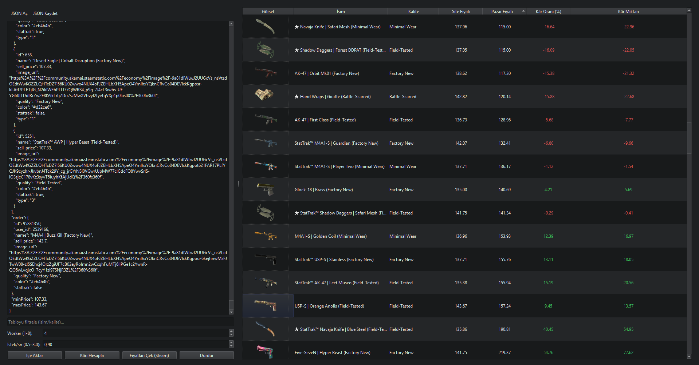

# SkinMarket Analyzer

PySide6 tabanlı CS2 skin fiyat izleyici. Steam Market'ten **pazar fiyatı** toplar, site fiyatınla
karşılaştırır; **kâr miktarı** ve **kâr oranını** hesaplar. Satıra çift tıklayınca öğenin
**Pricempire** sayfasını açar. İstek hızı ve worker sayısı ayarlanabilir, çekmeyi **Durdur** butonuyla kesebilirsin.

## Özellikler
- Steam `priceoverview` + **histogram fallback** (0 dönenlerde bile fiyat bulmaya çalışır)
- **Worker** ve **RPS** (istek/sn) ayarı
- **Durdur** butonu
- Tüm sayısal sütunlarda **doğru sıralama**
- Çift tık → **Pricempire** linki (StatTrak + wear slug’ları otomatik)
- JSON içe/dışa aktarma

## Ekran Görüntüsü
<!-- assets/ screenshot koyarsan burada göster -->
<!--  -->

## İndir
- En güncel Windows sürümü için: **[Releases](../../releases/latest)** bölümünden `SkinMarketAnalyzer.exe` indirin.

## Kurulum (geliştiriciler için)
```bash
python -m venv .venv
. .venv/Scripts/activate   # Windows
pip install -r requirements.txt
python app/ui_cs2_profiler.py
